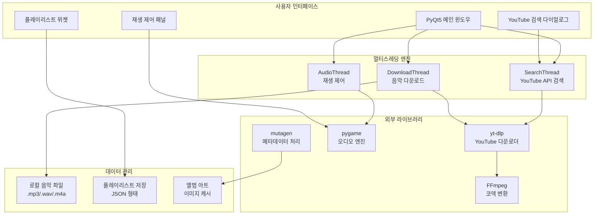

# 🎵 YouTube MP3 플레이어 시스템

<table>
<tr>
<td width="50%">

### 메인 플레이어 인터페이스


</td>
<td width="50%">
    
### YouTube 검색 다이얼로그


</td>
</tr>
</table>

<table>
<tr>
<td width="100%">

### 버튼 기능


</td>
</tr>
</table>


<div align="center">

[](https://www.python.org/downloads/)
[](https://pypi.org/project/PyQt5/)
[](https://github.com/yt-dlp/yt-dlp)

**PyQt5 기반 YouTube 음악 다운로드 및 스마트 MP3 플레이어**

*"YouTube에서 바로 다운로드하고 재생하는 올인원 뮤직 플레이어" - 멀티스레딩과 현대적 UI가 결합된 차세대 음악 관리 시스템*

</div>

---

## 📋 목차

- [🎯 주요 기능](#-주요-기능)
- [🏗️ 시스템 아키텍처](#️-시스템-아키텍처)
- [🚀 설치 및 실행](#-설치-및-실행)
- [📖 사용법](#-사용법)
- [⚙️ 설정](#️-설정)
- [🎛️ 플레이어 조작법](#️-플레이어-조작법)
- [📊 성능 정보](#-성능-정보)
- [🔧 문제해결](#-문제해결)
- [🛠️ 개발 정보](#️-개발-정보)
- [🤝 기여하기](#-기여하기)
- [📞 연락처](#-연락처)

---

## 🎯 주요 기능

### 🔍 YouTube 통합 검색 & 다운로드
- **실시간 YouTube 검색**: 키워드 입력으로 YouTube 음악 즉시 검색
- **고품질 MP3 변환**: yt-dlp 기반 192kbps 고품질 MP3 다운로드
- **자동 메타데이터**: 썸네일, 제목, 아티스트 정보 자동 추출
- **멀티스레딩 처리**: UI 끊김 없는 백그라운드 다운로드

### 🎵 고급 음악 재생 엔진
- **다중 포맷 지원**: MP3, WAV, M4A, FLAC, OGG, AAC 완벽 재생
- **정밀 음량 제어**: 실시간 음량 조절 및 페이드 효과
- **시크바 제어**: 마우스 클릭으로 정확한 재생 위치 이동
- **연속 재생**: 자동 다음 곡 재생 및 반복 모드

### 📋 스마트 플레이리스트 관리
- **자동 저장**: 플레이리스트 상태 자동 저장 및 복원
- **드래그 앤 드롭**: 직관적인 곡 순서 변경
- **로컬 파일 추가**: 기존 음악 파일 플레이리스트 통합
- **곡 정보 표시**: 실시간 재생 시간 및 곡 길이 표시

### 🎨 현대적 사용자 인터페이스
- **다크 테마**: 눈에 편한 어두운 테마 기본 제공
- **그라데이션 디자인**: 모던한 그라데이션 배경
- **반응형 레이아웃**: 플레이리스트 토글 및 유연한 창 크기 조절
- **직관적 아이콘**: 이모지와 명확한 버튼 레이블

---

## 🏗️ 시스템 아키텍처



### 📁 프로젝트 구조

```
MP3_Player/
├── main.py                       # 메인 실행 파일
├── mp3_player.ui                 # PyQt5 Designer UI 파일
├── images/                       # 리소스 이미지
│   └── music.jpg                # 기본 앨범 아트
├── downloads/                    # 다운로드된 음악 (자동 생성)
│   └── music/                   # 음악 파일 저장소
├── cache/                        # 캐시 파일 (자동 생성)
│   ├── thumbnails/              # 썸네일 이미지 캐시
│   └── metadata.json           # 메타데이터 캐시
├── config/                       # 설정 파일 (자동 생성)
│   ├── playlist.json            # 플레이리스트 저장
│   └── settings.json            # 사용자 설정
└── README.md                     # 프로젝트 설명
```

---

## 🚀 설치 및 실행

### 📋 시스템 요구사항

| 구분      | 최소 요구사항        | 권장 사양              |
|-----------|---------------------|----------------------|
| 운영체제   | Windows 10          | Windows 10/11        |
| Python    | 3.7 이상            | 3.9 이상             |
| RAM       | 4GB                 | 8GB 이상             |
| 저장공간   | 1GB                 | 10GB 이상            |
| 인터넷     | 브로드밴드 연결      | 고속 인터넷 연결      |

### 설치 과정

1. **저장소 복제**
```bash
git clone https://github.com/juntaek-oh/mp3_player.git
cd mp3_player
```

2. **Python 패키지 설치**
```bash
pip install PyQt5 yt-dlp mutagen pygame
```

3. **FFmpeg 설치 (필수)**

**Windows:**
```bash
# FFmpeg 공식 사이트에서 다운로드
https://ffmpeg.org/download.html

# C:\ffmpeg\bin\ 경로에 설치
# 시스템 환경변수 PATH에 C:\ffmpeg\bin 추가
```

**macOS (Homebrew):**
```bash
brew install ffmpeg
```

**Linux (Ubuntu/Debian):**
```bash
sudo apt update
sudo apt install ffmpeg
```

4. **프로젝트 폴더 구성 확인**
```
MP3_Player/
├── main.py              ✅ 메인 실행 파일
├── mp3_player.ui        ✅ UI 파일
└── images/
    └── music.jpg        ✅ 기본 앨범 아트
```

### ▶️ 실행 방법

**기본 실행**
```bash
python main.py
```

**디버그 모드**
```bash
python main.py --debug
```

---

## 📖 사용법

### YouTube 음악 다운로드
쉬운 3단계로 YouTube 음악을 다운로드하고 재생할 수 있습니다.

```
┌─────────────────────────────────────────────┐
│ 🎵 YouTube MP3 플레이어 | 재생 중: 2/15    │
├─────────────────────────────────────────────┤
│                                             │
│    🔍 [검색창] "아이유 미인"                 │
│    📥 [다운로드] 버튼 클릭                    │
│                                             │
│    검색 결과:                                │
│    ▶️ 미인 - 아이유 (IU) [Official MV]       │
│    ▶️ IU(아이유) - Beauty And The Beast      │
│    ▶️ 아이유 (IU) - 미인 라이브              │
│                                             │
│    [⏸️] [⏮️] [⏭️] [🔊━━━━━━] [📋]          │
│    00:32 ━━━●━━━━━━━━━━━ 03:45              │
└─────────────────────────────────────────────┘
   현재 재생: 미인 - 아이유 | 음량: 75%
```

**다운로드 방법:**
1. 📥 **다운로드 버튼** 클릭
2. 검색창에 원하는 음악 제목 입력 (예: "아이유 미인")
3. 🔍 **검색 버튼** 클릭하여 YouTube 검색
4. 검색 결과에서 원하는 음악 선택
5. **다운로드** 버튼 클릭 또는 더블클릭으로 자동 다운로드

### 플레이어 제어 방법
다양한 방식으로 음악을 제어할 수 있습니다.

---

## ⚙️ 설정

### 다운로드 경로 설정
```python
# main.py 파일에서 경로 변경
download_dir = r"C:\Users\USER\Downloads\music"  # 기본 경로
download_dir = r"D:\MyMusic"                      # 원하는 경로로 변경
```

### 음질 설정
```python
# YouTube 다운로드 옵션 (main.py에서 설정)
ydl_opts = {
    'format': 'bestaudio/best',
    'extractaudio': True,
    'audioformat': 'mp3',
    'preferredquality': '192',  # 음질 선택: 128, 192, 256, 320
    'outtmpl': download_path,
}
```

### 지원 파일 형식
```python
# 재생 가능한 오디오 형식
SUPPORTED_FORMATS = [
    'mp3', 'wav', 'm4a', 'flac', 'ogg', 'aac',
    'wma', 'opus', 'mp4', '3gp'
]
```

---

## 🎛️ 플레이어 조작법

### 기본 재생 컨트롤
- **▶️/⏸️ 버튼**: 재생/일시정지 토글
- **⏮️/⏭️ 버튼**: 이전곡/다음곡 이동
- **시크바**: 마우스 클릭으로 재생 위치 이동
- **🔊 슬라이더**: 음량 조절 (0-100%)

### 플레이리스트 관리
- **📁 추가**: 로컬 음악 파일 플레이리스트 추가
- **📋 목록**: 플레이리스트 패널 토글 (숨기기/보이기)
- **삭제**: 선택한 곡을 플레이리스트에서 제거
- **더블클릭**: 플레이리스트에서 곡 더블클릭으로 즉시 재생
- **자동 저장**: 플레이리스트 자동 저장 및 프로그램 재시작 시 복원

### 고급 기능
- **드래그 앤 드롭**: 탐색기에서 음악 파일을 드래그하여 추가
- **키보드 단축키**: 스페이스바(재생/일시정지), 화살표 키(음량 조절)
- **메타데이터 표시**: 곡 제목, 아티스트, 길이 정보 실시간 표시

---

## 📊 성능 정보

### 다운로드 성능

| 음질     | 파일 크기 (3분 기준) | 다운로드 시간 (100Mbps) |
|----------|---------------------|-------------------------|
| 128kbps  | ~2.8MB             | 3-5초                   |
| 192kbps  | ~4.2MB             | 4-6초                   |
| 256kbps  | ~5.6MB             | 5-8초                   |
| 320kbps  | ~7.0MB             | 6-10초                  |

### 시스템 리소스 사용량
- **CPU 사용률**: 유휴 시 5%, 다운로드 시 15-25%
- **메모리 사용**: 기본 50MB, 대용량 플레이리스트 시 최대 200MB
- **네트워크**: 다운로드 시 최대 대역폭 사용, 재생 시 0

### 지원 플랫폼별 성능
```
Windows 10/11:  ✅ 완벽 지원 (권장)
macOS:          ⚠️  부분 지원 (FFmpeg 별도 설치 필요)
Linux:          ⚠️  부분 지원 (의존성 설치 필요)
```

---

## 🔧 문제해결

### 일반적인 문제들

**❌ "yt-dlp가 설치되지 않았습니다"**
```bash
# 해결 방법
pip install --upgrade yt-dlp
# 또는
pip uninstall yt-dlp
pip install yt-dlp
```

**❌ "FFmpeg를 찾을 수 없습니다"**
- FFmpeg 설치 상태 확인: `ffmpeg -version`
- 환경변수 PATH에 FFmpeg 경로 추가
- 시스템 재부팅 후 다시 시도

**❌ "다운로드 실패"**
- 인터넷 연결 상태 확인
- YouTube 영상 접근 가능 여부 확인 (지역 제한, 삭제된 영상)
- 방화벽 또는 안티바이러스 소프트웨어 확인

**❌ "UI 파일을 찾을 수 없습니다"**
- `mp3_player.ui` 파일이 `main.py`와 같은 폴더에 있는지 확인
- 파일 권한 확인 (읽기 권한 필요)

**❌ "재생 오류"**
- pygame 설치 확인: `pip install pygame`
- 오디오 드라이버 업데이트
- 오디오 파일 손상 여부 확인

### 고급 트러블슈팅

```python
# 디버그 모드 실행 시 상세 로그 확인
python main.py --debug

# 캐시 초기화
import os
import shutil
shutil.rmtree('./cache/')  # 캐시 폴더 삭제 후 재실행
```

---

## 🛠️ 개발 정보

### 핵심 클래스 구조

**MusicPlayer (메인 클래스)**
```python
class MusicPlayer(QMainWindow):
    def __init__(self):
        # UI 초기화
        # 오디오 엔진 설정
        # 플레이리스트 관리
        
    def play_music(self):      # 음악 재생
    def download_music(self):  # YouTube 다운로드
    def manage_playlist(self): # 플레이리스트 관리
```

**SearchThread (검색 스레드)**
```python
class SearchThread(QThread):
    def run(self):
        # YouTube API를 통한 비동기 검색
        # 검색 결과 반환
        # UI 업데이트 신호 발송
```

**DownloadThread (다운로드 스레드)**
```python
class DownloadThread(QThread):
    def run(self):
        # yt-dlp를 통한 비동기 다운로드
        # 진행률 업데이트
        # 완료 시 플레이리스트 자동 추가
```

### 사용된 기술 스택
- **GUI**: PyQt5 (크로스 플랫폼 GUI 프레임워크)
- **YouTube 처리**: yt-dlp (YouTube 다운로드)
- **오디오 재생**: pygame (멀티미디어 라이브러리)
- **메타데이터**: mutagen (오디오 파일 정보 처리)
- **코덱 변환**: FFmpeg (미디어 처리 프레임워크)

### 향후 개발 계획
- **스트리밍 모드**: 다운로드 없이 직접 재생
- **이퀄라이저**: 주파수 대역별 음량 조절
- **가사 표시**: LRC 파일 지원 및 자동 가사 다운로드
- **온라인 라디오**: 인터넷 라디오 스테이션 통합
- **클라우드 동기화**: Google Drive, Dropbox 연동

---

## 🤝 기여하기

1. 프로젝트 Fork
2. Feature Branch 생성 (`git checkout -b feature/AmazingFeature`)
3. 커밋 (`git commit -m 'Add some AmazingFeature'`)
4. 브랜치 푸시 (`git push origin feature/AmazingFeature`)
5. Pull Request 생성

### 🐛 버그 리포트

Issues 탭에 다음 정보를 포함해 제출해주세요:
- 운영체제 및 Python 버전
- 설치된 패키지 버전 (`pip list`)
- FFmpeg 설치 상태 (`ffmpeg -version`)
- 에러 메시지 전체
- 재현 가능한 단계별 설명
- 다운로드하려던 YouTube 링크 (해당시)

### 🎨 UI/UX 개선 제안

새로운 디자인이나 사용성 개선 아이디어가 있으시면:
- 목업 이미지 또는 스케치 첨부
- 현재 UI의 문제점 설명
- 개선 후 기대 효과 설명

---

## 📄 라이선스 및 저작권

### 🔒 라이선스 정보
이 프로젝트는 **MIT 라이선스** 하에 배포됩니다. 개인적 및 교육적 목적으로 자유롭게 사용할 수 있습니다.

### ⚠️ 저작권 주의사항
- **YouTube 콘텐츠**: 다운로드한 음악의 저작권은 원 저작자에게 있습니다
- **상업적 사용**: 저작권 법규를 반드시 준수하세요
- **개인 사용**: 개인적인 음악 감상 목적으로만 사용하세요
- **배포 금지**: 다운로드한 음악 파일을 재배포하지 마세요

### 🛡️ 면책 조항
본 소프트웨어는 교육 및 연구 목적으로 제작되었습니다. 사용자는 관련 법률 및 YouTube 이용약관을 준수할 책임이 있습니다.

---

## 📞 연락처

- **개발자**: 오준택
- **이메일**: [ojt8416@gmail.com](mailto:ojt8416@gmail.com)
- **GitHub**: [@juntaek-oh](https://github.com/juntaek-oh)
- **프로젝트 링크**: [https://github.com/juntaek-oh/mp3_player](https://github.com/juntaek-oh/mp3_player)

---

<div align="center">

## 🎵 음악과 함께하는 새로운 경험, YouTube MP3 플레이어! 🎵
**PyQt5와 yt-dlp의 완벽한 조합으로 구현한 차세대 음악 관리 시스템**

⭐ 도움 되셨다면 Star 부탁드립니다! ⭐

**즐거운 음악 감상되세요!** 🎧

</div>
